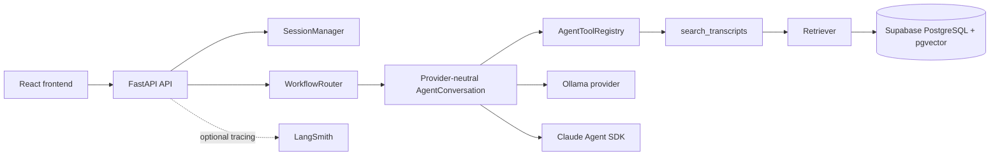

# Architecture

## System overview

Lenny Growth Assistant is a FastAPI backend and React/Vite frontend for asking product and growth questions over the selected indexed Lenny transcript corpus. Retrieval produces inspectable evidence; providers generate grounded prose from that evidence.

## Request lifecycle

1. The frontend posts a query and optional `session_id`.
2. FastAPI validates the request and supplies a request-scoped async database session.
3. `SessionManager` creates or resumes an `AgentConversation`.
4. `WorkflowRouter` selects `grounded_qa`, `research_synthesis`, or `ship30`.
5. Transcript-related work calls `search_transcripts`, which reuses the existing retriever.
6. The selected provider generates from bounded transcript context and bounded conversational history.
7. The API returns the answer and source metadata, or SSE events for streaming.

## RAG pipeline

The selected corpus is indexed with local `BAAI/bge-small-en-v1.5` embeddings at 384 dimensions. PostgreSQL/pgvector performs semantic cosine retrieval and PostgreSQL full-text search supplies keyword candidates. The existing retrieval layer merges and ranks candidates and supports one corrective retrieval attempt. Transcript metadata remains attached to each result: episode slug, guest, title, URL, chunk index, stable chunk ID, and score.

Conversation history is context only. It is never returned as transcript evidence and does not replace fresh retrieval on transcript-related turns.

## Agent and tool architecture

The central `AgentToolRegistry` exposes:

- `search_transcripts` — structured transcript retrieval through the existing retriever.
- `validate_ship30_draft` — validates Ship 30 structure and returns issues/redraft guidance.
- `create_artifact` — produces structured Markdown/HTML artifact output for the UI.

Claude uses the Claude Agent SDK with in-process MCP registration. Ollama uses the same provider-neutral agent workflow rather than a second RAG implementation.

## Workflow routing

- `grounded_qa`: answer a direct transcript-grounded question.
- `research_synthesis`: compare themes and patterns across retrieved episodes.
- `ship30`: draft, validate, and optionally perform one controlled redraft.

## Provider architecture

Configuration selects `claude` or `ollama`. Claude uses `ANTHROPIC_API_KEY` and `CLAUDE_MODEL`; Ollama uses `OLLAMA_BASE_URL`, `OLLAMA_MODEL=llama3.2:1b`, and `OLLAMA_TIMEOUT_SECONDS`. Provider keys remain backend-only.

## Session architecture

`SessionManager` maintains stable 24-hour in-memory sessions. Each contains an `AgentConversation`, bounded history, and cleanup/clear behavior. Claude reuses one interactive `ClaudeSDKClient` per live session. Ollama receives bounded prior turns on subsequent requests. The retriever is rebound to the current request-scoped database session.

Current limitation: in-memory sessions do not survive a backend restart and are not authenticated or user-isolated. PostgreSQL stores transcript knowledge data, not durable conversation history, in the current milestone.

## Streaming architecture

`POST /api/v1/agent/ask/stream` uses Server-Sent Events. Retrieval completes before generation; only generated text is streamed. Event types are `session`, `workflow`, `token`, `sources`, `validation`, `done`, and `error`. The frontend incrementally appends token events and preserves partial output on failure.

## Observability

LangSmith is optional and configured with `LANGCHAIN_TRACING_V2`, `LANGCHAIN_API_KEY`, and `LANGCHAIN_PROJECT`. Existing tracing/logging covers API, workflow, retrieval/tool, embedding/provider, generation, validation, artifacts, and failures where supported. The application must continue without LangSmith credentials.

## Security boundaries

Transcript text is evidence, not instructions. Prompts require grounded answers and explicit insufficiency when evidence is weak. Provider and LangSmith secrets stay on the backend. Generated HTML is untrusted and must be sanitized or isolated before production use. Current in-memory sessions require a future authentication/ownership layer for multi-user deployment.

## Architecture image placeholder

Add the final annotated architecture image at `photos/architecture.png` when available.
