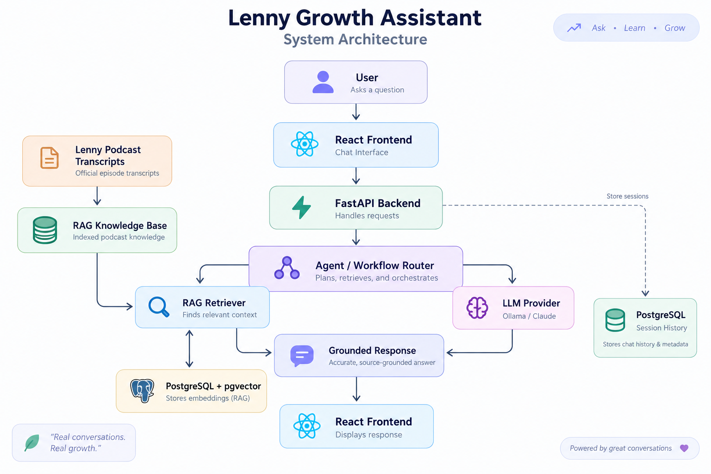
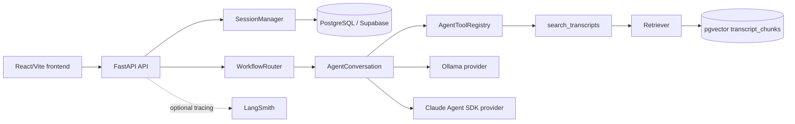

# Architecture

The image above is the supplied repository-level architecture visual. The diagrams below describe the executable boundaries in the current codebase.

## System architecture

The frontend never receives provider secrets. The backend owns provider selection, database access, transcript retrieval, session persistence, and tool execution.

## Request lifecycle

1. The frontend sends a query and optional `session_id` to `/api/v1/agent/ask` or `/api/v1/agent/ask/stream`.
2. FastAPI validates the request and supplies a request-scoped async SQLAlchemy session.
3. `SessionManager` creates a durable `conversation_sessions` row or loads the requested session and ordered `conversation_messages` history.
4. `WorkflowRouter` selects `grounded_qa`, `research_synthesis`, or `ship30`.
5. Transcript-related work calls `search_transcripts`, which uses the current request-scoped `Retriever`.
6. The selected provider receives bounded conversation context and retrieved evidence. Conversation history is context only; it is not transcript evidence.
7. Successful turns persist user and assistant messages. Streaming persists the assistant message only after successful completion.
8. The API returns JSON or SSE events with the session, workflow, answer, sources, validation, completion, and errors.

## RAG pipeline

The selected transcript corpus is normalized, chunked, and embedded locally with `BAAI/bge-small-en-v1.5` at 384 dimensions. Chunks and source metadata are stored in PostgreSQL with pgvector. The active `Retriever` performs cosine similarity search and applies configured top-k, minimum-score, episode, and guest filters.

`backend/app/rag/retrieval.py` also contains a bounded hybrid/corrective retrieval service combining semantic and PostgreSQL keyword candidates. The current agent tool is wired to `backend/app/rag/retriever.py`; therefore hybrid/corrective retrieval is an available service boundary, not a claim that every production agent request currently uses it.

Every returned source preserves episode slug, guest, title, URL, chunk index, stable chunk ID, text, and similarity information where available.

## Agent, tools, and workflows

The central `AgentToolRegistry` exposes exactly the current product tools:

- `search_transcripts`: retrieves structured transcript evidence through the existing retriever.
- `validate_ship30_draft`: checks Ship 30 structure and returns validation issues/redraft guidance.
- `create_artifact`: produces structured Markdown/HTML artifact output for the UI.

Claude uses the Claude Agent SDK and in-process MCP registration. Ollama uses the same provider-neutral orchestration and tool contracts. `WorkflowRouter` selects the grounded QA, research/synthesis, or Ship 30 path; the Ship 30 flow permits at most one controlled validation/redraft cycle.

## Provider architecture

`LLM_PROVIDER` selects `ollama` or `claude`. Ollama uses `OLLAMA_BASE_URL`, `OLLAMA_MODEL`, and configurable `OLLAMA_TIMEOUT_SECONDS`; Claude uses `ANTHROPIC_API_KEY` and `CLAUDE_MODEL`. Normal and SSE generation share the provider abstraction, and provider status is exposed by the backend health endpoint for the UI.

## Session architecture

`ConversationSession` and `ConversationMessage` are durable PostgreSQL models introduced by Alembic revision `0003_conversation_sessions`. `SessionManager` is the single session abstraction: it creates, loads, lists, updates, and deletes durable sessions, loads ordered history on continuation, and persists successful turns.

The manager also keeps bounded live `AgentConversation` state in memory for provider execution and expires that optimization after 24 hours via `cleanup_expired()`. Expiration removes only the in-memory execution state; PostgreSQL remains the source of truth and can reconstruct a session after restart. Claude can reuse its live interactive client while present; Ollama reconstructs bounded context from persisted messages. No authentication or user ownership boundary exists yet.

## Streaming architecture

`POST /api/v1/agent/ask/stream` uses Server-Sent Events. Retrieval completes before generation; only generated provider output is streamed. Event types are `session`, `workflow`, `token`, `sources`, `validation`, `done`, and `error`. The user message is persisted when streaming begins; the assistant message is persisted only after successful completion, so a failed partial stream is not stored as a completed answer.

## Observability

LangSmith is optional and configured with `LANGCHAIN_TRACING_V2`, `LANGCHAIN_API_KEY`, and `LANGCHAIN_PROJECT`. Structured tracing/logging is present around API/workflow execution, retrieval and tools, embedding/query stages where instrumented, provider generation, Ship 30 validation/redraft, artifact generation, and failures. Missing LangSmith credentials must not block local Ollama execution.

## Security boundaries

Transcript text is evidence, not instructions. Grounding prompts require evidence-backed claims and explicit insufficiency. Provider and LangSmith secrets stay backend-only. Generated HTML is untrusted and requires sanitization or isolation verification before treating it as production-safe. Durable sessions currently lack authentication and ownership checks, so this is a single-user/local or trusted-environment architecture.

## Known boundaries

- The indexed corpus is intentionally limited to the selected episodes.
- Live Supabase, Ollama, Claude, LangSmith, and Docker behavior must be verified in the target environment.
- A measured retrieval benchmark and formal artifact sandbox verification remain follow-up work.
